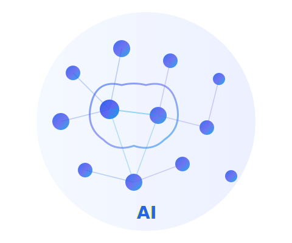

# AIVerse

**Learn Artificial Intelligence from Zero to Hero.**

AIVerse is a free, open-source educational website built to teach Artificial Intelligence from beginner to advanced level. It is also designed for students learning open-source contribution — the repository intentionally contains beginner-friendly GitHub issues while remaining fully functional.



## Quick Start

No build tools, no backend, no package manager required. Simply open the website in your browser:

```bash
# Clone the repository
git clone https://github.com/your-username/aiverse.git
cd aiverse

# Open in your default browser
open index.html        # macOS
# or double-click index.html in your file explorer
```

That's it! The entire site runs with plain HTML, CSS, and JavaScript.

## Features

- **10 Learning Pages** — AI Basics, Machine Learning, Deep Learning, Prompt Engineering, RAG, AI Agents, Resources, FAQ, and Contact
- **Responsive Design** — Mobile-first layout for desktop, laptop, tablet, and mobile
- **Dark Mode** — Toggle with preference saved in `localStorage`
- **Smooth Animations** — Scroll reveal, hover effects, and subtle CSS transitions
- **FAQ Accordion** — Interactive expand/collapse powered by vanilla JavaScript
- **Accessible** — Semantic HTML, ARIA attributes, proper heading hierarchy
- **Open Source Ready** — ~60 intentional improvement issues for contributors

## Folder Structure

```
AIVerse/
├── index.html                  # Home page
├── ai-basics.html              # AI fundamentals
├── machine-learning.html       # ML algorithms & workflow
├── deep-learning.html          # Neural networks & frameworks
├── prompt-engineering.html     # LLM prompt techniques
├── rag.html                    # Retrieval-Augmented Generation
├── ai-agents.html              # Autonomous AI agents
├── resources.html              # Curated learning resources
├── faq.html                    # Frequently asked questions
├── contact.html                # Contact form (frontend only)
│
├── css/
│   ├── style.css               # Main styles & CSS variables
│   ├── responsive.css          # Breakpoints & mobile nav
│   └── animations.css          # Scroll reveal & hover effects
│
├── js/
│   ├── script.js               # Navigation, scroll, forms
│   ├── faq.js                  # FAQ accordion logic
│   └── darkmode.js             # Theme toggle & localStorage
│
├── images/
│   └── hero-illustration.svg   # Hero section illustration
│
├── icons/                      # Future icon assets
│
└── README.md
```

## Tech Stack

| Technology | Purpose |
|---|---|
| HTML5 | Semantic page structure |
| CSS3 | Styling with CSS variables |
| Vanilla JavaScript | Interactivity (no frameworks) |
| Google Fonts (Poppins) | Typography |
| Font Awesome 6 | Icons |

**No React, Vue, Angular, Bootstrap, Tailwind, or any backend.**

## JavaScript Features

| Feature | File | Description |
|---|---|---|
| Mobile Navigation | `script.js` | Hamburger menu toggle for small screens |
| Sticky Header | `script.js` | Header shadow on scroll |
| Active Nav Link | `script.js` | Highlights current page in navbar |
| Smooth Scrolling | `script.js` | Anchor links scroll smoothly |
| Back to Top | `script.js` | Floating button appears after scrolling |
| Scroll Reveal | `script.js` | Elements animate in on scroll |
| FAQ Accordion | `faq.js` | Expand/collapse FAQ items |
| Dark Mode | `darkmode.js` | Toggle theme, save to localStorage |
| Newsletter Form | `script.js` | Frontend-only subscription handler |
| Contact Form | `script.js` | Frontend-only form validation |

## Contributing

We welcome contributors of all skill levels! This project is intentionally designed with improvement opportunities.

### How to Contribute

1. Fork the repository
2. Browse [Issues](https://github.com/your-username/aiverse/issues) labeled `good first issue`
3. Create a branch: `git checkout -b fix/your-fix-name`
4. Make your changes
5. Test by opening `index.html` in your browser
6. Submit a Pull Request

### Good First Issues to Look For

- Fix "recieve" → "receive" in the newsletter section (`index.html`)
- Add a favicon to all pages
- Make border-radius consistent across card components
- Add `:focus-visible` styles to social link buttons
- Improve mobile timeline layout on small screens
- Add email format validation to the contact form
- Refactor repeated navbar/footer HTML into a shared template approach

## Learning Roadmap

Follow this path through AIVerse:

1. [AI Basics](ai-basics.html) → 2. Python → 3. [Machine Learning](machine-learning.html) → 4. [Deep Learning](deep-learning.html) → 5. NLP → 6. LLMs → 7. [Prompt Engineering](prompt-engineering.html) → 8. Vector Databases → 9. [RAG](rag.html) → 10. [AI Agents](ai-agents.html) → 11. Deployment

## License

This project is open source under the [MIT License](LICENSE).

## Community

- **GitHub Issues** — Report bugs and request features
- **Pull Requests** — Submit improvements
- **Discord** — Join discussions (link coming soon)

---

Built with passion for AI education. **Learn. Build. Contribute.**
=======

